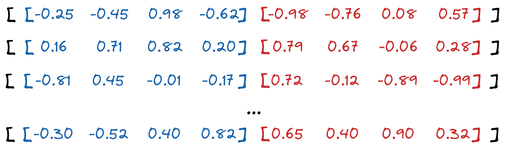
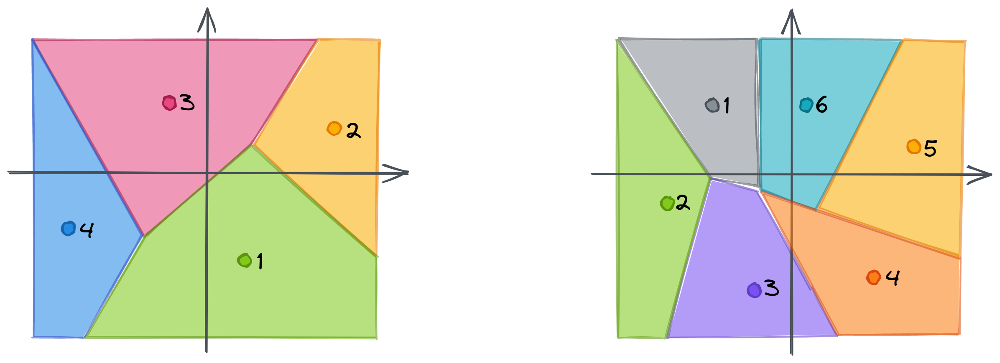
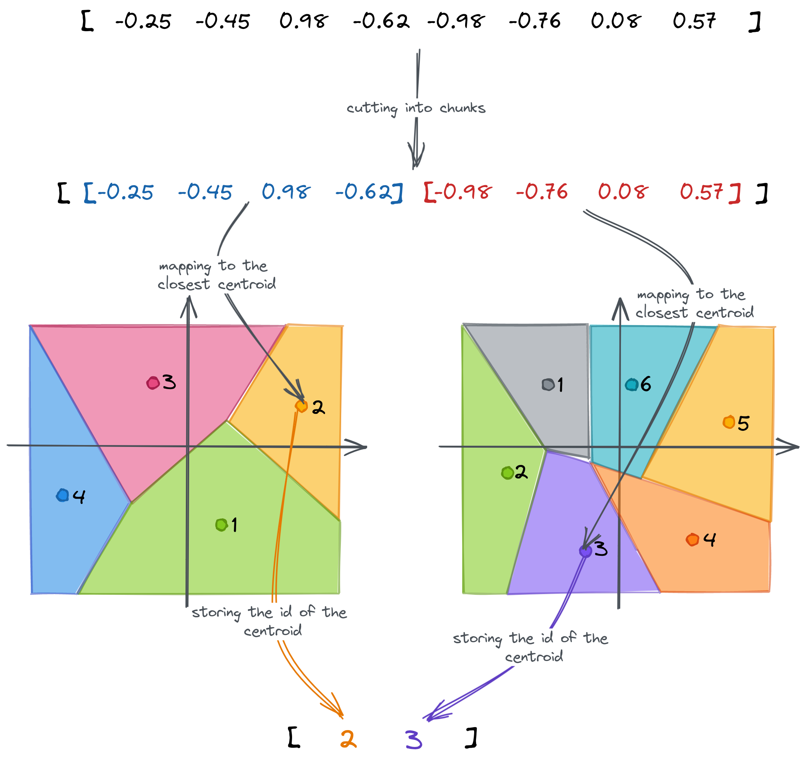
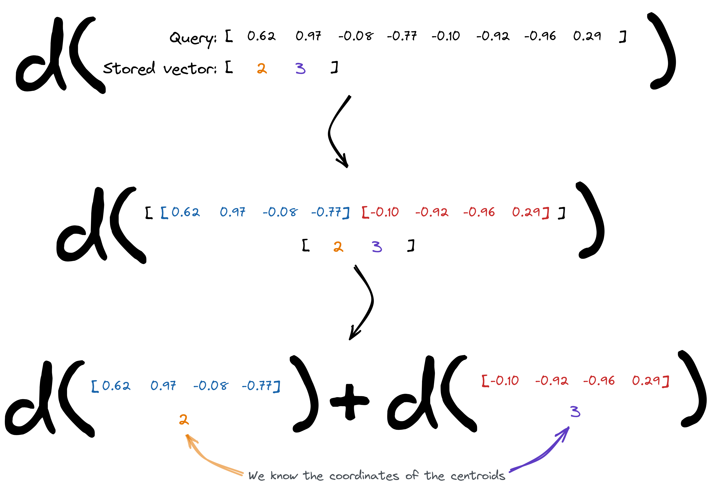

# Quantization

Product Quantization converts floating-point numbers into integers like every other quantization method. However, the process is slightly
more complicated than Scalar Quantization and is more customizable, so you can find the sweet spot between memory usage and search
precision. This article covers all the steps required to perform Product Quantization and the way it’s implemented in Pyapay.

Let’s assume we have a few vectors being added to the collection and that our optimizer decided to start creating a new segment.

### Cutting the vector into pieces

First of all, our vectors are going to be divided into **chunks** aka **subvectors**. The number of chunks is configurable, but as a rule of
thumb - the lower it is, the higher the compression rate. That also comes with reduced search precision, but in some cases, you may prefer
to keep the memory usage as low as possible.

Pyapay API allows choosing the compression ratio from 4x up to 64x. In our example, we selected 16x, so each subvector will consist of 4
floats (16 bytes), and it will eventually be represented by a single byte.

### Clustering

The chunks of our vectors are then used as input for clustering. Pyapay uses the K-means algorithm, with K\=256. It was selected a priori,
as this is the maximum number of values a single byte represents. As a result, we receive a list of 256 centroids for each chunk and assign
each of them a unique id. **The clustering is done separately for each group of chunks.**

Each chunk of a vector might now be mapped to the closest centroid. That’s where we lose the precision, as a single point will only
represent a whole subspace. Instead of using a subvector, we can store the id of the closest centroid. If we repeat that for each chunk, we
can approximate the original embedding as a vector of subsequent ids of the centroids. The dimensionality of the created vector is equal to
the number of chunks, in our case 2.

### Full process

All those steps build the following pipeline of Product Quantization:

Measuring the distance
-------------------------------------------------

Vector search relies on the distances between the points. Enabling Product Quantization slightly changes the way it has to be calculated.
The query vector is divided into chunks, and then we figure the overall distance as a sum of distances between the subvectors and the
centroids assigned to the specific id of the vector we compare to. We know the coordinates of the centroids, so that’s easy.

